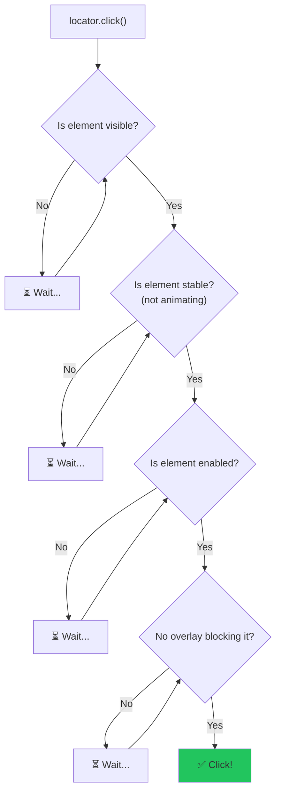
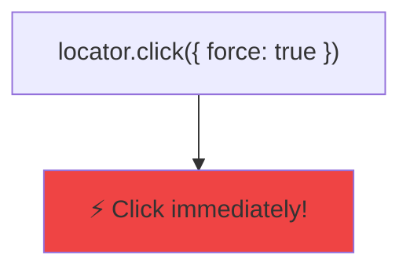
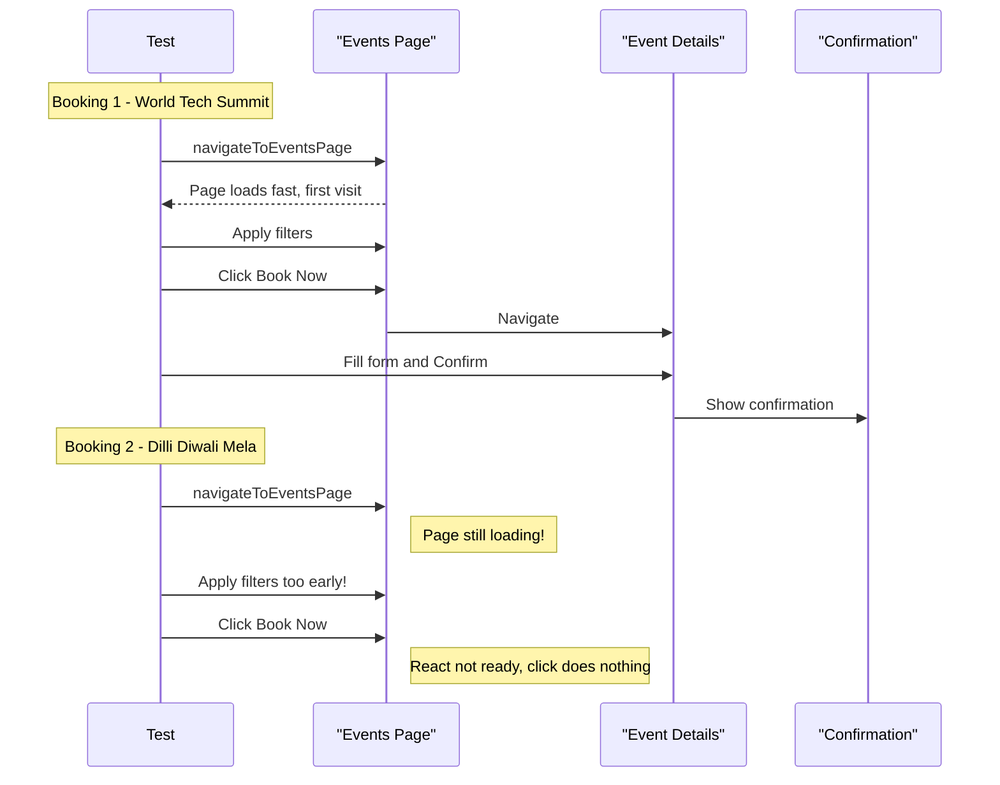
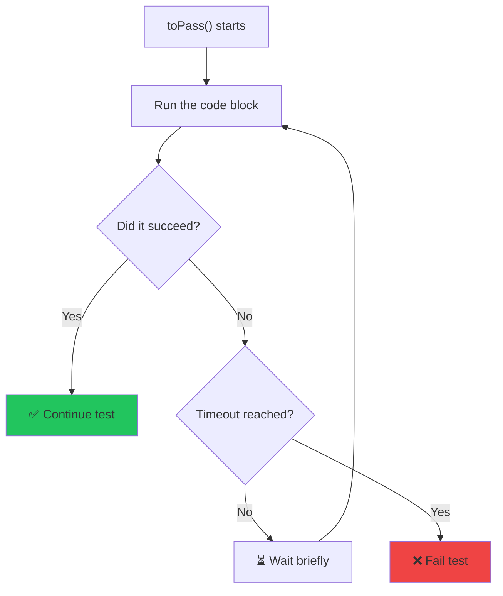

# 🐛 Incident Analysis: Flaky "Book Now" Click in SPA

## Table of Contents
- [What Was Happening](#what-was-happening)
- [Understanding the App Architecture](#understanding-the-app-architecture)
- [The Three Bugs](#the-three-bugs)
- [Bug #1: `force: true` on Click](#bug-1-force-true-on-click)
- [Bug #2: `waitForURL` Hanging on SPA Navigation](#bug-2-waitforurl-hanging-on-spa-navigation)
- [Bug #3: No Wait After Page Navigation](#bug-3-no-wait-after-page-navigation)
- [The Fix: `toPass()` Retry Pattern](#the-fix-topass-retry-pattern)
- [Key Playwright Concepts Learned](#key-playwright-concepts-learned)
- [Code Changes Summary](#code-changes-summary)

---

## What Was Happening

The test `Book multiple events to build history` was **flaky** — it would sometimes pass and sometimes fail with this error:

```
Error: expect(locator).toBeVisible() failed
Locator: locator('#customerName')
Expected: visible
Timeout: 5000ms
```

The test clicks the **"Book Now"** link on an event card, expecting to navigate to the Event Details page where a `#customerName` input field should appear. But sometimes the page **never navigated** — it stayed on the Events list page, and `#customerName` was never found.

> [!IMPORTANT]
> The key clue was: **"it passes when I click manually, but fails in automation."** This is the classic symptom of a **race condition** — automation is faster than humans, so it hits timing windows that manual testing doesn't.

---

## Understanding the App Architecture

EventHub is a **React Single Page Application (SPA)**. This is critical to understand because SPAs work differently from traditional websites:

### Traditional Website (Multi-Page App)
```
Click link → Browser sends request to server → Server returns new HTML page → Browser renders it
```
- Each page is a full HTTP request/response
- The browser fires a `load` event after each navigation
- Playwright's `waitForURL` works perfectly here

### SPA (Single Page App) — What EventHub Uses
```
Click link → JavaScript intercepts click → React Router updates URL via history.pushState()
                                         → React re-renders components (no server request)
```
- The page **never fully reloads** — JavaScript swaps out components
- No `load` event fires on navigation
- The URL changes via `history.pushState()`, not via a real HTTP navigation
- **React Router** handles all navigation client-side

### What is React Router's `<Link>` Component?

The "Book Now" element in the HTML looks like a normal link:
```html
<a href="/events/1">Book Now</a>
```

But it's actually rendered by React Router's `<Link>` component, which:
1. Renders as a normal `<a>` tag (so it looks like a link)
2. Attaches a JavaScript `onClick` handler that calls `event.preventDefault()` (stops the browser from doing a normal navigation)
3. Instead, uses `navigate('/events/1')` to do a client-side route change

**This means: if the `onClick` handler isn't attached yet, clicking the link does NOTHING.**

---

## The Three Bugs

### Bug #1: `force: true` on Click

#### The Original Code
```js
// ❌ FLAKY — in EventHubHelper.js
await eventCardPage.getEventCardDetails(targetEventCard).bookNowEvent.click({ force: true });
```

#### What `force: true` Does

When you call `.click()` in Playwright, it performs **actionability checks** before clicking:



When you add `{ force: true }`, it **skips ALL of these checks**:



#### Why This Caused Flakiness

With `force: true`, Playwright clicks the "Book Now" link **immediately** — even if:
- The element is still animating into position
- React is still re-rendering the card after filter changes
- React Router's `onClick` handler hasn't been attached yet

**Result:** The click fires, but since React's handler isn't ready, the click does nothing. No navigation happens. The page stays on the Events list.

> [!TIP]
> **Playwright Best Practice:** Never use `force: true` unless you're testing a specific edge case (like clicking a visually hidden element on purpose). Playwright's auto-waiting is one of its best features — don't bypass it!

---

### Bug #2: `waitForURL` Hanging on SPA Navigation

#### The Original Code
```js
// ❌ HANGS — in EventHubHelper.js
await this.page.waitForURL(/events\/.+/);
```

#### How `waitForURL` Works

`page.waitForURL(urlPattern)` does two things:
1. Waits for the page URL to match the pattern
2. Waits for the page to reach the **`load`** state (this is the default `waitUntil` option)

#### Why It Hangs on SPAs

In a SPA, when React Router navigates from `/events?city=Hyderabad` to `/events/1`:

| Step | Traditional Site | SPA (React Router) |
|------|-----------------|-------------------|
| URL changes | ✅ Yes | ✅ Yes (via `pushState`) |
| HTTP request | ✅ Yes | ❌ No |
| `load` event fires | ✅ Yes | ❌ **No!** |

Since no `load` event fires, `waitForURL` waits forever → **test timeout!**

#### Could We Fix It with `waitUntil`?

```js
// This would work IF the click actually navigated:
await this.page.waitForURL(/events\/.+/, { waitUntil: 'commit' });
```

But since Bug #1 means the click often doesn't navigate at all, this alone wouldn't fix the issue.

---

### Bug #3: No Wait After Page Navigation

#### The Original Code
```js
// ❌ NO WAIT — in EventCardPage.js
async navigateToEventsPage() {
    await this.eventsPageLocator.click();
    // Returns immediately! Page might not be loaded yet.
}
```

#### Why This Matters

The test runs bookings in a loop:



For the **first booking**, the events page loads quickly (it might be cached or pre-rendered). But for the **second booking**, the test navigates FROM the confirmation page TO the events page — this involves React Router unmounting the confirmation view and mounting the events view. `navigateToEventsPage()` returns before this is complete.

#### The Fix
```js
// ✅ FIXED — in EventCardPage.js
async navigateToEventsPage() {
    await this.eventsPageLocator.click();
    await expect(this.headingLocator).toBeVisible(); // Wait for "Upcoming Events" heading
}
```

> [!TIP]
> **Playwright Best Practice:** After any navigation action, always wait for a meaningful element on the destination page before proceeding. Don't just click and hope — **assert** the page loaded.

---

## The Fix: `toPass()` Retry Pattern

### What is `toPass()`?

`expect(...).toPass()` is Playwright's built-in retry mechanism. It re-runs a block of code until it succeeds or times out:



### How We Used It

```js
// ✅ FIXED — in EventHubHelper.js
await expect(async () => {
    await bookNowLink.click();      // Try clicking
    await expect(eventDetailsPage.customerNameLocator)
        .toBeVisible({ timeout: 3000 });  // Check if we navigated
}).toPass({ timeout: 15000 });            // Retry for up to 15 seconds
```

**What happens:**

| Attempt | Click | Navigation? | Result |
|---------|-------|------------|--------|
| 1st | Clicks "Book Now" | ❌ React handler not ready | Retries... |
| 2nd | Clicks "Book Now" | ❌ Still not ready | Retries... |
| 3rd | Clicks "Book Now" | ✅ Handler attached, navigates! | `#customerName` visible → **Success!** |

### Why This Works

- **Attempt 1-2:** React is still attaching event handlers after the filter re-render. The click fires but nothing happens. `toBeVisible()` fails after 3 seconds (inner timeout).
- **Attempt 3:** React has finished rendering. The click triggers React Router's navigation. The page changes to Event Details, `#customerName` appears.
- The outer `toPass({ timeout: 15000 })` keeps retrying the entire block.

> [!TIP]
> **Playwright Best Practice:** `toPass()` is the idiomatic way to handle flaky interactions in Playwright. It's better than:
> - `page.waitForTimeout(3000)` — arbitrary sleep, slows tests
> - `force: true` — bypasses safety checks
> - `try/catch` with manual retry — reinventing the wheel

---

## Key Playwright Concepts Learned

### 1. Actionability Checks
Playwright automatically waits for elements to be **visible, stable, enabled, and unobstructed** before interacting. Don't bypass this with `force: true`.

### 2. SPA vs Traditional Navigation
In SPAs, navigation happens via JavaScript (`history.pushState`), not HTTP requests. This means:
- No `load` event fires
- `waitForURL` with default options may hang
- Always wait for **destination page elements**, not URL changes

### 3. The Rendering Gap
In React/Vue/Angular apps, there's a gap between when an element **appears in the DOM** and when its **event handlers are attached**. Playwright sees the element as "visible" but it's not yet interactive.

```
DOM renders <a> tag  →  Element visible  →  React attaches onClick  →  Element interactive
        ↑                     ↑                      ↑
   Playwright sees it    toBeVisible() passes    Click actually works
```

### 4. `toPass()` for Unreliable Interactions
Use `toPass()` whenever an interaction might not work on the first try due to timing:
```js
await expect(async () => {
    await element.click();
    await expect(result).toBeVisible({ timeout: 2000 });
}).toPass({ timeout: 10000 });
```

### 5. Always Wait After Navigation
After clicking a navigation link, **always wait for a landmark element** on the destination page:
```js
await navLink.click();
await expect(page.getByText('Page Title')).toBeVisible(); // ✅ Confirm page loaded
```

---

## Code Changes Summary

### File 1: [EventHubHelper.js](file:///c:/Users/yuvra/Downloads/Playwright/Playwright%20Assignment/utlis/EventHubHelper.js)

```diff
  await expect(bookNowLink).toBeVisible();

- // OLD CODE (flaky):
- await eventCardPage.getEventCardDetails(targetEventCard).bookNowEvent.click({ force: true });
- await this.page.waitForURL(/events\/.+/);
- await expect(eventDetailsPage.customerNameLocator).toBeVisible();

+ // NEW CODE (stable):
+ await expect(async () => {
+     await bookNowLink.click();
+     await expect(eventDetailsPage.customerNameLocator).toBeVisible({ timeout: 3000 });
+ }).toPass({ timeout: 15000 });
```

**What changed:**
- ❌ Removed `force: true` — let Playwright auto-wait
- ❌ Removed `waitForURL` — doesn't work with SPA pushState
- ✅ Added `toPass()` retry — handles the rendering gap
- ✅ Used stored `bookNowLink` variable — cleaner, avoids re-querying

---

### File 2: [EventCardPage.js](file:///c:/Users/yuvra/Downloads/Playwright/Playwright%20Assignment/POM/EventCardPage.js)

```diff
+ import { expect } from "@playwright/test";

  async navigateToEventsPage() {
      await this.eventsPageLocator.click();
+     await expect(this.headingLocator).toBeVisible();
  }
```

**What changed:**
- ✅ Added wait for "Upcoming Events" heading after navigation
- ✅ Ensures the events page is fully loaded before any filter operations

---

## Quick Reference: When to Use What

| Scenario | ❌ Don't Use | ✅ Use Instead |
|----------|-------------|---------------|
| SPA link click doesn't navigate | `force: true` | `toPass()` retry |
| Wait for SPA page change | `waitForURL()` | `expect(element).toBeVisible()` |
| After clicking nav link | Nothing (hope it loaded) | `expect(heading).toBeVisible()` |
| Element exists but not interactive | `waitForTimeout(3000)` | `toPass()` with inner timeout |
| Flaky test that "sometimes passes" | Run it again and pray 🙏 | Investigate the **race condition** |
